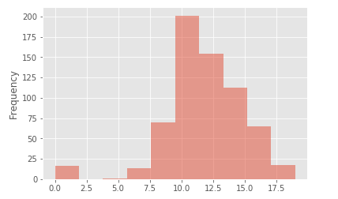
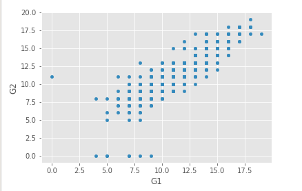
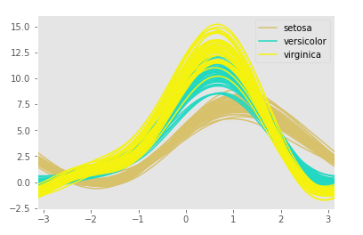
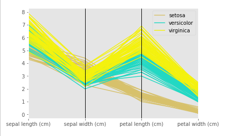
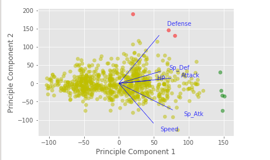
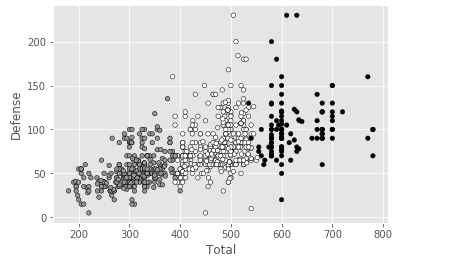

# Python Data Science

## Datasets
1. [face.mat](https://raw.githubusercontent.com/authman/DAT210x/master/Cached%20Datasets/face_data.zip)
2. [pokemon](https://www.kaggle.com/terminus7/pokemon-challenge/data)
3. [seeds.txt](https://archive.ics.uci.edu/ml/machine-learning-databases/00236/seeds_dataset.txt)
4. [students.data](https://d37djvu3ytnwxt.cloudfront.net/assets/courseware/v1/c6c89d8ef70c9b6d0923d9c171fee75a/asset-v1:Microsoft+DAT210x+2T2017+type@asset+block/students.zip)
5. [titanic](https://www.kaggle.com/c/titanic/data)
6. [weather](https://www.kaggle.com/mahirkukreja/delhi-weather-data/data)

## Features
#### 1. Histogram

#### 2. Scatter Matrices

#### 3. Andrew Curves

#### 4. Parallel Coordinates

#### 5. Dimensionality Reduction - pca, isomap

#### 6. Clustering - kmeans

## Source
The work is completed based on the knowledge provided through edx course [Python for Data Science](https://courses.edx.org/courses/course-v1:Microsoft+DAT210x+2T2017/course/)

## Also see
### 1. [Delhi Weather](https://gihub.com/rajat19/Pyscience/WEATHER.md)
### 2. [Religion Map](https://gihub.com/rajat19/Pyscience/RELIGION.md)