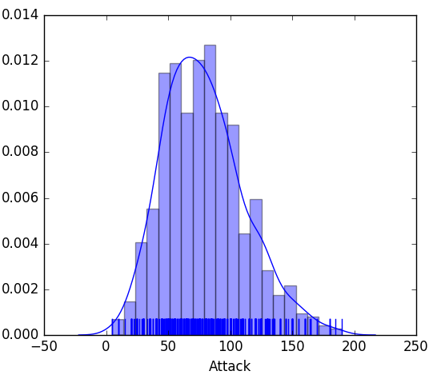

# Python Data Science

Refer [Old Readme File](./OLD_README.md) for old references

## Graphs (Seaborn)

### Visualizing distribution of a dataset
#### 1. distplot

#### 2. kdeplot

#### 3. jointplot

#### 4. rugplot

#### 5. pairplot

### Plotting with categorical data
#### 1. stripplot

#### 2. swarmplot

#### 3. boxplot

#### 4. violinplot

### Visualizing linear relationships
#### 1. regplot

#### 2. lmplot

#### 3. residplot