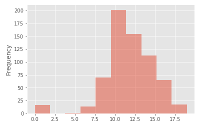
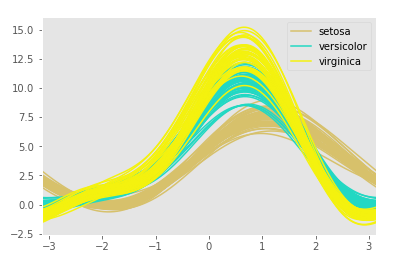
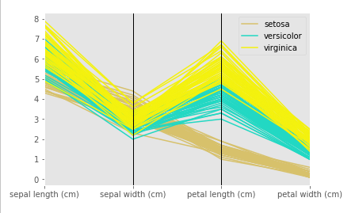
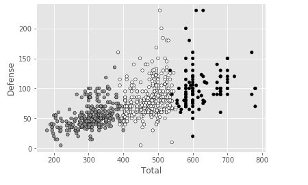

# Python Data Science

## Datasets
1. [face.mat](https://raw.githubusercontent.com/authman/DAT210x/master/Cached%20Datasets/face_data.zip)
2. [pokemon.csv](https://storage.googleapis.com/kaggle-datasets/121/280/pokemon.zip?GoogleAccessId=datasets@kaggle-161607.iam.gserviceaccount.com&Expires=1502606174&Signature=2dTSz%2F7T7ZGzBZGLKB5n%2Fkrv0sTNOlbGNKMEKX2Mj4iCZwlkr%2FFTfiRbdOBrmTrp1We4XDAz%2FsITOTK2SZNHqIiYRu2%2FiXfuFXgYIbQ7MJt794eWn5XdBtnadeCkxvkMx%2BRB7DOYbTus0jvgupdUv%2BYNlGHL8sLO%2BcbIx652HQfRSJ62QWYiCj2i09z6Wvhcx9mrcWnMswjkQhLhQilNodmxrYIfWlPRuSicwmaaB2pB4rcM9MSupyz%2Fdt0bBhNoxaSNvqfei223T8rHIqxlI0GaOeM2lQDvxQKJBu2p6MAaiwxD4k0tpSyv5mdc0WmLgyUb0%2Big%2BJgm17yt4MrDEg%3D%3D)
3. [seeds.txt](https://archive.ics.uci.edu/ml/machine-learning-databases/00236/seeds_dataset.txt)
4. [students.data](https://d37djvu3ytnwxt.cloudfront.net/assets/courseware/v1/c6c89d8ef70c9b6d0923d9c171fee75a/asset-v1:Microsoft+DAT210x+2T2017+type@asset+block/students.zip)

## Features
1. Histogram

2. Scatter Matrices

3. Andrew Curves

4. Parallel Coordinates

5. Dimensionality Reduction - pca, isomap

6. Clustering - kmeans

## Source
The work is completed based on the knowledge provided through edx course [Python for Data Science](https://courses.edx.org/courses/course-v1:Microsoft+DAT210x+2T2017/course/)
